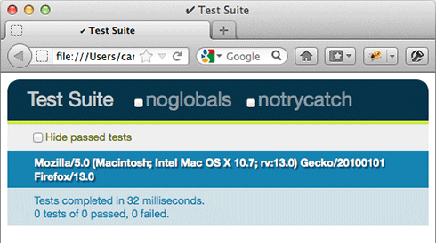
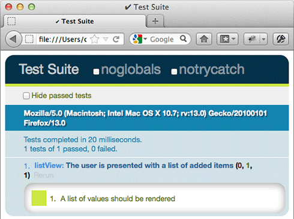

# Making JavaScript testing in the browser not suck with sinon.js (Part 1)

Writing tests for JavaScript is tough and often overlooked. I'm going to do my best to persuade you why you need them and more importantly how to make it easier to write them with an awesome library called [sinon.js](http://sinonjs.org/).

## When to write them
Writing JavaScript tests might seem like overkill when you already have a solid functional test suite. Perhaps you're writing nothing but glue code to pull a handful of off the shelf plugins together. In this case you might be able to get away without having JavaScript tests.

Consider the following when deciding whether to write JavaScript tests for a piece of functionality:

### Could this be used on more than one page or multiple times on a single page?
To properly test your code in a functional suite you'd have to run all your tests on every instance instead of just verifying that it has been initialised where expected. This would slow down your build and introduce duplicate tests.

### Is it non trivial?
If there's a lot going on within your code then for the sake of peace of mind during refactoring you'll want to be able to rely on your tests to keep you on track.

If you find yourself answering yes to either of the above it's probably a good idea to write some JavaScript tests.

## Getting started
The are several mature testing frameworks out there and while I have my preferences it's up to you to make up your mind which meets your needs.

* [QUnit](http://qunitjs.com/)
* [Mocha](http://visionmedia.github.com/mocha/)
* [Jasmine](http://pivotal.github.com/jasmine/)

### Setting up
First we'll need to create a page to run our tests. We'll include the libraries we plan to use to write our tests.

In my examples I'm going to use QUnit simply because it's the framework I'm most familiar with and the tests are the easiest to read. Check out [using QUnit](http://docs.jquery.com/QUnit#Using_QUnit) for detailed setup instructions. You'll also need sinon, so head over to [sinonjs.com](http://sinonjs.com) and download it along with the QUnit adapter.

Here's my test runner, I've chucked in jQuery too because it's a defacto standard and makes it much easier to test the DOM.

    <!DOCTYPE html>
    <html>
      <head>
        <meta charset="UTF-8" />
        <title>Test Suite</title>
        <link rel="stylesheet" href="qunit.css" />
        
        
        
        
      </head>
      <body>
        

        

      </body>
    </html>

If we run that in a browser we should see this:

### Writing a simple test
Lets start with something very basic. We're going to write something that will let us build up a list of values and render them to a page. We could start with a test like this:

    module('listView');

    test('The user is presented with a list of added items', function () {
      document.getElementById('qunit-fixture').innerHTML = '

';
      var domList = document.getElementById('list'),
          list = listView(domList);

      list.addOne('javascript');
      list.render();

      equal(domList.innerHTML, 'javascript', 'A single value should be rendered');

      list.addOne('ftw');
      list.render();

      equal(domList.innerHTML, 'javascript ftw', 'A list of values should be rendered');
    });

Here we're creating a fixture element and instantiating our new module. We're then exercising a public method called addOne with a string and asserting that each time we call render the expected string is inserted into our element. Lets run our test and see it fail:

Now lets write some code to get this test to pass:

    var listView = function (domEl) {
      var items = [];
      return {
        addOne: function (value) {
          items.push(value);
        },
        render: function () {
          domEl.innerHTML = items.join(' ');
        }
      };
    };

There we go, our first test passes. Now onto more complicated matters.

### Getting asyncronous
Now lets alter our listView module to load some data from the server. This presents us with two problems:

1. We don't want to request data from a real server. This would be slow and means we can't test our code in isolation.
2. The request could return at any time and our test doesn't know when to expect it.

### Sinon.js to the rescue
Sinon is a collection of utterly essential testing tools that among other things enable you to deal with tricky asyncronous code and server requests.

Lets write a new test:
  
    var xhr,
        requests,
        domList;

    module('listView', {
      setup: function () {
        xhr = sinon.useFakeXMLHttpRequest()
        requests = [];
        xhr.onCreate = function (r) {
          requests.push(r);
        };
        document.getElementById('qunit-fixture').innerHTML = '

';
        domList = document.getElementById('list');
      },
      teardown: function () {
        xhr.restore();
      }
    });

    test('The list is populated from the server', function () {
      var list = listView(domList);
      list.fetch();

      equal(requests.length, 1, 'One XHR request should be made');

      requests[0].respond(200, {'Content-Type': 'application/json'}, '["XHR", "INNIT"]');

      equal(requests[0].url, '/path/to/list.json', 'A request to the correct URL should be made');

      list.render();

      equal(domList.innerHTML, 'XHR INNIT', 'The retrieved values should be rendered');
    });

We've now defined a setup function for our test suite which setups a fake XMLHttpRequest object that will intercept any attempt to communicate over XHR and allow us to define our own responses. Even better it will make our request syncronous since we're responding to our fake request immediately from inside our test; pretty cool. 

Lets update listView and get that test to pass:

    var listView = function (domEl) {
      var items = [];
      return {
        addOne: function (value) {
          items.push(value);
        },
        render: function () {
          domEl.innerHTML = items.join(' ');
        },
        fetch: function () {
          $.getJSON('/path/to/list.json', function (response) {
            items = response;
          });
        }
      };
    };

Run the tests

Perfect.

### Burning through time
When testing JavaScript animation or other asyncronous functionality based on timeouts and intervals you don't want to have to wait for them to finish in your tests.

Sinon.js solves this for you with fake timers. Sinon will replace the browsers timing functions with it's own. This enables you to advance the clock manually and test what your code does in response.

Lets write a test to animate a simple cube:

    test('cube is animated for 1 second', function () {
      document.getElementById('qunit-fixture').innerHTML = '

';

      var domCube = document.getElementById('cube'),
          cube = animatedCube(domCube),
          clock = sinon.useFakeTimers();

      cube.animate();

      clock.tick(100);

      equal(domCube.style.left, '10px', 'Cube has moved 10px left after 100ms');

      clock.tick(100);

      equal(domCube.style.left, '20px', 'Cube has moved 20px left after 200ms');

      clock.tick(800);

      equal(domCube.style.left, '100px', 'Cube has moved 100px left after 1000ms');

      clock.tick(100);

      equal(domCube.style.left, '100px', 'Cube has stopped moving');

      clock.restore();
    });

In this test we're telling sinon to replace the browsers timers and then incrementally advancing the timer to interesting points in our animation and asserting that the cube is where we expect it to be.

And now lets make the test pass:

    var animatedCube = function (domEl) {
      var x = 0,
          start,
          diff,
          interval,
          loop = function () {
            diff = Date.now() - start;
            x = Math.round((100 / 1000) * diff);
            domEl.style.left = x + 'px';
            if (x >= 100) clearInterval(interval);
          };

      domEl.style = 'width:10px;height:10px;background-color:red;position:relative';

      return {
        animate: function () {
          start = Date.now();
          interval = setInterval(loop, 10);
        }
      };
    };

Hopefully this has served as a useful introduction to effective JavaScript testing in the browser.

In the second part of this article i'll write about sinon spies, mocks and stubs.

