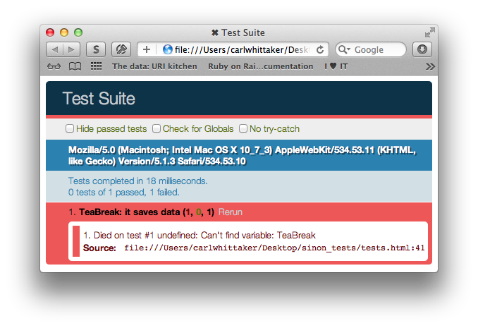
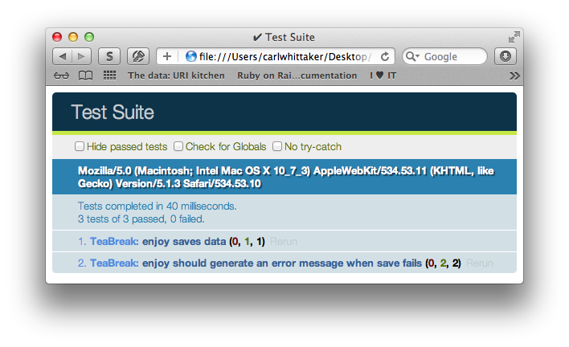

# Making JavaScript testing in the browser not suck with Sinon.js (Part 2)

This is the continuation of my post on Sinon.js, the first part can be found [testing_javascript_part1](here).

I'm going to describe the basic usage of Sinon's mocks, spies, and stubs.

## Getting started
Assuming you've read the first part you should already have a test suite up and running with your framework of choice. So i'll just get right into it.

## Mocks
Mocks replace APIs with fake methods. We can use mocks to make expectations. Expectations allow us to ensure that the methods on our API are called correctly.

### Benefits:
* Tests run more quickly
* Bugs can be traced more easily
* Tests are easier to read

Heres an example test utilising a mock:
  
    module('TeaBreak');

    test('enjoy should save data', 1, function () {
      var mock = sinon.mock(Network);
      mock.expects('save')
        .once()
        .withArgs({cuppa: 'lovely'});

      new TeaBreak({cuppa: 'lovely'}).enjoy();

      mock.verify();
    });

Here we're setting an expection. We're expecting the "save" method on the "Network" object to be called with the correct arguments.

Lets run the test and watch it fail.

Now to write some code to make it pass.

    var TeaBreak = function (data) {
      this.data = data;
    };

    TeaBreak.prototype = {
      enjoy: function () {
        Network.save(this.data);
      }
    };

And run the test.

Perfect.

The Sinon expectation API is chainable and features everything you need to specify the state in which a method should be called. More options can be found in the Sinon documentation here [http://sinonjs.org/docs/#expectations](http://sinonjs.org/docs/#expectations).

## Stubs
Like mocks stubs can be used to replace methods on an API. We can use stubs to force our code down a particular path. This allows us to test how our code responds to errors and different return values in isolation.

Heres an example of a stub in action.

    test('enjoy should generate an error message when save fails', 2, function () {
      sinon.stub(Network, 'save').returns(false);

      var elevenses = new TeaBreak({cuppa: 'lovely'});
      elevenses.enjoy();

      equal(elevenses.errors.length, 1, 'One error should be generated');
      equal(elevenses.errors[0], 'No break for you :(');

      Network.save.restore();
    });

Here we're creating a stub for "save" on our Network API. We're telling it to return false when its called. We're then expecting an error message to be added to our instance of TeaBreak.

If we run our tests we should see one failure.

And if we write some code to make it pass.

    var TeaBreak = function (data) {
      this.errors = [];
      this.data = data;
    };

    TeaBreak.prototype = {
      enjoy: function () {
        if (false === Network.save(this.data)) {
          this.errors.push('No break for you :(');
        }
      }
    };

Then run our tests.

There we go.

The Sinon stub API gives us everything we need to simulate the behaviour of an external dependency. Sinon stubs are immensely flexible. We can instruct them to perform many complex actions; such as automatically triggering callbacks with predefined arguments while specifying the context in which they are called. The full stub API can be found here [http://sinonjs.org/docs/#stubs-api](http://sinonjs.org/docs/#stubs-api)

## Spies
Spies are great for testing the conditions around which a callback is called. They can be used to ensure that events are triggered as expected.

Heres an example of a spy in action

    test('callback is triggered', function () {
      var callback = sinon.spy();

      var elevenses = new TeaBreak({cuppa: 'lovely'});
      elevenses.on('enjoyed', callback);
      elevenses.enjoy();

      ok(callback.calledOnce);
    });

We're creating a spy and subscribing it to an event on our subject. We then exercise our subject and expect that the callback was called once.

Lets watch the test fail.

Now lets write some code to make it pass.

    var TeaBreak = function (data) {
      this.errors = [];
      this.topics = {};
      this.data = data;
    };

    TeaBreak.prototype = {
      enjoy: function () {
        if (false === Network.save(this.data)) {
          this.errors.push('No break for you :(');
        } else {
          this.publish('enjoyed');
        }
      },
      on: function(topic, fn) {
        this.topics[topic] = fn;
      },
      publish: function(topic) {
        if (this.topics[topic]) this.topics[topic]();
      }
    };

Run the tests

Spot on.

